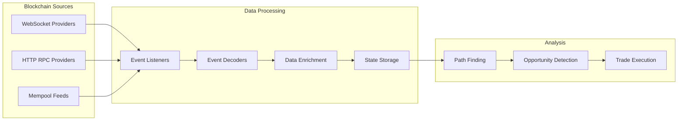

# Advanced Multi-Chain MEV & Arbitrage Trading System

A sophisticated, production-grade MEV (Maximal Extractable Value) and arbitrage trading system built in Rust that supports both live trading and historical backtesting across multiple blockchain networks. The system integrates with the Universal Arbitrage Router (UAR) smart contract for atomic, multi-step arbitrage execution.

## 🏗️ System Architecture

### Core Components

```mermaid
graph TB
    subgraph "Entry Point"
        MAIN[main.rs<br/>Application Entry Point]
        CONFIG[config.rs<br/>Modular Configuration]
    end
    
    subgraph "Live Trading Mode"
        MEV_ENGINE[mev_engine.rs<br/>MEV Engine - Core Orchestrator]
        ALPHA_ENGINE[alpha/engine.rs<br/>Alpha Engine - Strategy Coordinator]
        LISTEN[listen.rs<br/>Real-time Event Listeners]
        MEMPOOL[mempool.rs<br/>Mempool Monitor]
    end
    
    subgraph "Backtesting Mode"
        BACKTEST[backtest.rs<br/>Backtester]
        SWAP_LOADER[swap_loader.rs<br/>Historical Data]
    end
    
    subgraph "Discovery & Scanning"
        DISCOVERY[strategies/discovery/<br/>Discovery Scanners]
        CYCLIC[cyclic_scanner.rs<br/>Cyclic Arbitrage]
        STATISTICAL[statistical_scanner.rs<br/>Statistical Arbitrage]
        CROSS_CHAIN[cross_chain_scanner.rs<br/>Cross-Chain Arbitrage]
        MARKET_MAKING[market_making_scanner.rs<br/>Market Making]
    end
    
    subgraph "MEV Strategies"
        ARBITRAGE[strategies/arbitrage.rs<br/>Arbitrage Strategy]
        SANDWICH[strategies/sandwich.rs<br/>Sandwich Strategy]
        LIQUIDATION[strategies/liquidation.rs<br/>Liquidation Strategy]
        JIT_LIQUIDITY[strategies/jit_liquidity.rs<br/>JIT Liquidity]
    end
    
    subgraph "Core Infrastructure"
        BLOCKCHAIN[blockchain.rs<br/>Blockchain Manager]
        PATH[path.rs<br/>Path Finder]
        POOL_MGR[pool_manager.rs<br/>Pool Manager]
        GAS[gas_oracle/<br/>Gas Oracle]
        PRICE[price_oracle/<br/>Price Oracle]
        RISK[risk.rs<br/>Risk Manager]
    end
    
    subgraph "UAR Integration"
        UAR_CONNECTOR[uar_connector.rs<br/>UAR Connector]
        UAR_CONTRACT[contracts/uar.sol<br/>Universal Arbitrage Router]
        EXECUTION[execution/<br/>Transaction Builder]
    end
    
    subgraph "Data Pipeline"
        BIN[bin/<br/>Data Tools]
        STATE[state.rs<br/>State Management]
    end
    
    MAIN --> CONFIG
    MAIN --> MEV_ENGINE
    MAIN --> ALPHA_ENGINE
    MAIN --> BACKTEST
    
    MEV_ENGINE --> DISCOVERY
    MEV_ENGINE --> ARBITRAGE
    MEV_ENGINE --> SANDWICH
    MEV_ENGINE --> LIQUIDATION
    MEV_ENGINE --> JIT_LIQUIDITY
    
    ALPHA_ENGINE --> DISCOVERY
    ALPHA_ENGINE --> CYCLIC
    ALPHA_ENGINE --> STATISTICAL
    ALPHA_ENGINE --> CROSS_CHAIN
    ALPHA_ENGINE --> MARKET_MAKING
    
    DISCOVERY --> PATH
    DISCOVERY --> POOL_MGR
    DISCOVERY --> PRICE
    
    MEV_ENGINE --> UAR_CONNECTOR
    UAR_CONNECTOR --> UAR_CONTRACT
    UAR_CONNECTOR --> EXECUTION
    
    PATH --> BLOCKCHAIN
    POOL_MGR --> BLOCKCHAIN
    ARBITRAGE --> GAS
    ARBITRAGE --> PRICE
    ARBITRAGE --> RISK
    
    BIN --> STATE
```

## 🚀 Key Features

### Multi-Chain Support
- **Ethereum** (Mainnet, Polygon, Arbitrum, Optimism)
- **Solana** (Mainnet)
- **Cross-chain arbitrage** via bridge protocols
- **Configurable chain endpoints** with failover support

### MEV Strategies
- **Sandwich Attacks** - Front-run and back-run victim transactions
- **Liquidation Opportunities** - Liquidate undercollateralized positions
- **JIT (Just-In-Time) Liquidity** - Provide liquidity for specific trades
- **Arbitrage Execution** - Execute profitable arbitrage opportunities
- **Oracle Updates** - Exploit oracle update opportunities
- **Flash Loan Arbitrage** - Use flash loans for capital-efficient arbitrage

### Discovery Scanners
- **Cyclic Arbitrage Scanner** - Find circular arbitrage opportunities
- **Statistical Arbitrage Scanner** - Identify statistical arbitrage based on z-scores
- **Cross-Chain Arbitrage Scanner** - Discover cross-chain arbitrage via bridges
- **Market Making Scanner** - Find market making opportunities

### Advanced Features
- **Real-time mempool monitoring** for MEV protection
- **Circuit breaker** protection against losses
- **Market regime detection** (Bull/Bear/Sideways)
- **Risk management** with configurable thresholds
- **Transaction optimization** with Flashbots support
- **Competition simulation** in backtesting
- **MEV attack simulation** (sandwich, front-running)
- **AI-powered parameter tuning** via chatbot operator

## 📊 Data Pipeline

### Live Data Ingestion

### Historical Data Tools (`src/bin/`)
- **`swap.rs`** - Historical swap event ingestion with multi-protocol support
- **`cg_pools.rs`** - Pool data collection and management from CoinGecko API
- **`prices.rs`** - Price data aggregation and market trend analysis
- **`coins.rs`** - Token metadata management and decimal fetching
- **`dexes.rs`** - DEX protocol data collection
- **`trades.rs`** - Trade data collection from on-chain sources

## 🔧 Configuration System

### Modular Configuration (`config/`)
- **`main.json`** - Execution mode and global settings
- **`chains.json`** - Multi-chain configuration with RPC endpoints
- **`modules.json`** - Module-specific settings (arbitrage, risk, gas, etc.)
- **`backtest.json`** - Backtesting parameters and simulation settings
- **`gas_estimates.json`** - Protocol-specific gas estimates

### Key Configuration Areas
- **Chain endpoints** with failover and rate limiting
- **Risk parameters** (max exposure, slippage, volatility)
- **Trading parameters** (min profit, concurrency, timeouts)
- **Gas optimization** settings
- **MEV protection** configuration
- **Cross-chain bridge** settings

## 🏃‍♂️ Execution Modes

### Live Trading Mode
1. **Event-Driven Architecture**: Real-time blockchain event listeners
2. **Multi-Chain Coordination**: Simultaneous monitoring of multiple chains
3. **Opportunity Detection**: Continuous scanning for profitable MEV and arbitrage
4. **Risk Assessment**: Real-time risk evaluation before execution
5. **Transaction Optimization**: MEV protection and gas optimization
6. **Execution Monitoring**: Real-time trade tracking and performance metrics

### Backtesting Mode
1. **Historical Data Loading**: Efficient loading of historical swap events
2. **Deterministic Simulation**: Reproducible backtesting with configurable parameters
3. **Competition Simulation**: Realistic bot competition modeling
4. **MEV Attack Simulation**: Sandwich and front-running attack simulation
5. **Performance Analysis**: Comprehensive metrics and reporting
6. **Parameter Optimization**: Automated parameter tuning

## 🛡️ Risk Management

### Multi-Layer Risk Protection
- **Circuit Breaker**: Automatic shutdown on consecutive losses
- **Risk Scoring**: Multi-factor risk assessment (volatility, liquidity, slippage, MEV, gas)
- **Exposure Limits**: Per-trade and total exposure controls
- **Slippage Protection**: Maximum slippage thresholds
- **Liquidity Requirements**: Minimum liquidity thresholds
- **Market Regime Adaptation**: Dynamic parameter adjustment based on market conditions

### MEV Protection
- **Mempool Monitoring**: Real-time transaction monitoring
- **Flashbots Integration**: Private transaction submission
- **Sandwich Detection**: Identification of sandwich attacks
- **Front-Running Protection**: Transaction ordering optimization

## 📈 Performance Monitoring

### Real-Time Metrics
- **Success Rate**: Trade execution success percentage
- **Profit/Loss**: Real-time P&L tracking
- **Gas Efficiency**: Gas cost optimization metrics
- **Latency**: Execution latency measurements
- **Competition Analysis**: Win/loss rates against other bots

### Historical Analysis
- **Sharpe Ratio**: Risk-adjusted returns
- **Maximum Drawdown**: Worst historical loss period
- **Win Rate**: Percentage of profitable trades
- **Average Profit**: Mean profit per trade
- **Volatility Analysis**: Price volatility tracking

## 🔌 Integration Points

### External APIs
- **1inch API**: Quote aggregation
- **Chainlink**: Price feeds
- **Bridge Protocols**: Cross-chain transfers
- **MEV Protection Services**: Flashbots, private relays

### Database Integration
- **PostgreSQL**: Primary data storage
- **Redis**: Caching layer
- **Time-series Data**: Historical analysis storage
